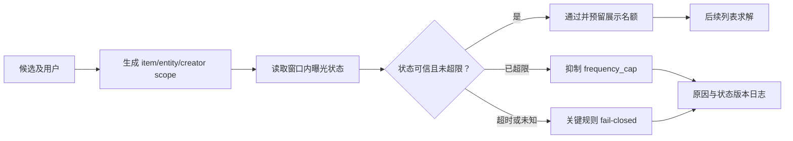

# 频控与疲劳控制

频控与疲劳控制限制用户在特定时间窗内对同一物品、实体、创作者、类目或运营活动的重复曝光。它保护的不是单次列表的多样性，而是跨请求的用户体验：一个候选即使本次 L2 分数很高，也可能因近期已被充分展示而不应再次进入最终列表。

本专题是必经约束，不是可由更高相关性补偿的负向特征。短期主题覆盖属于[列表重排](../../列表重排/README.md)，而长期探索预算和延迟价值策略属于[长期策略](../../长期策略/README.md)。

## 1. 频控对象与输入契约

频控规则由“谁、什么对象、哪个窗口、最大次数”共同定义：

$$
count(u, g, [t-W,t)) < cap(g, W),
$$

其中用户 $u$、规则粒度 $g$ 可为 `item`、`entity`、`creator`、`category` 或活动；$W$ 是滚动窗口。一个候选可同时命中多条规则，任一硬频控拒绝即不可展示。

| 输入/状态 | 说明 | 必须明确的语义 |
| --- | --- | --- |
| 请求时间 `now` | 频控判定的时间锚点 | 时钟来源、时区与迟到事件处理 |
| `user_id` 与 scope key | 例如 `creator:alice` | 跨端账号合并与匿名态策略 |
| `window_seconds`、`max_exposures` | 规则版本中下发 | 滚动窗口还是自然日窗口 |
| exposure state | 已展示、已点击或已消费事件 | 事件定义、去重键和可见延迟 |
| state read result | 命中、未命中、超时、未知 | 关键规则未知时的 fail-closed 策略 |



## 2. 状态模型与并发语义

线上状态通常按 `(user_id, scope, rule_version)` 分片保存时间戳队列、计数桶或带 TTL 的计数器。选择数据结构时需要同时考虑窗口精度、存储成本和原子性：

| 方案 | 优点 | 局限 | 适用条件 |
| --- | --- | --- | --- |
| 时间戳队列 | 精确滚动窗口、可回放 | 热用户写放大 | 强频控对象数量有限 |
| 时间桶计数 | 存储稳定、查询快 | 窗口边界近似 | 容忍小误差的疲劳控制 |
| TTL 计数器 | 实现简单、吞吐高 | 难表达滑动窗口与重复事件 | 固定窗口的轻量规则 |

“检查未超限”和“登记本次展示”需要原子完成，或通过 reservation/幂等曝光事件避免并发请求同时放行第 $cap+1$ 次。浏览日志到达晚于展示决策时，应以请求侧预留或去重 token 补偿，不能只依赖异步日志回写。

## 3. 复杂度、状态形态与请求预算

令 $N$ 为候选数、$R$ 为启用的频控规则数。若逐候选逐规则远程读取和保留，逻辑次数为 $O(NR)$，并会放大为同量级的 RPC/原子操作；这通常不能满足 L3 的延迟预算。应先按 `user_id + scope` 去重，再批量 multi-get，并只对最终可能展示的唯一作用域执行原子保留。

| 状态表示 | 单次查询/裁剪 | 每用户-作用域空间 | 精度与代价 |
| --- | --- | --- | --- |
| 窗口内时间戳队列（样例） | $O(H)$ | $O(H)$ | $H$ 为窗口事件数，精确但高频场景需严格上界。 |
| 固定时间桶 | $O(B)$ | $O(B)$ | $B$ 为桶数；用边界误差换取可预测空间。 |
| TTL 计数器 | 近似 $O(1)$ | $O(1)$ | 低成本，但只能表达有限的窗口语义。 |

读取、判断和写入必须由同一脚本或事务完成；把它们拆成多个并发 RPC 即使降低了单次等待，也会破坏上限语义。记录批大小、唯一作用域数、原子保留耗时和拒绝率，才能定位 fan-out 或状态热点。

## 4. 最小可运行示例

[frequency_cap.py](./frequency_cap.py) 以可注入的内存状态演示滚动窗口判定、展示预留与 `frequency_cap` 原因码；[example.py](./example.py) 演示两次放行后第三次被拒绝。

```powershell
python example.py
```

样例不实现跨进程一致性、持久化、事件流回填或服务超时。生产系统应以原子存储操作或事务脚本实现同等语义，并把读取失败显式映射为 `state_unknown`、`state_timeout` 等原因码。

## 5. 降级、观测与验收

- 区分强频控与弱疲劳控制：前者读状态失败时应拒绝，后者只有在明确获批的降级策略下才可放行，并记录降级版本。
- 对同一请求内的多个同 scope 候选按最终展示顺序预留，避免列表内自己突破 cap。
- 记录规则版本、scope、窗口、读取延迟、决策前计数、预留结果、幂等 token 和最终曝光是否成功。
- 在离线回放中检查窗口边界、重复上报、跨端合并、冷启动、并发请求和状态延迟；线上观察命中率、误拦截率、状态超时率、重复曝光率与候选不足率。

## 常见误解

- **只在曝光日志到达后再计数即可**：并发请求会在日志回写前同时放行，强频控必须有同步预留或等价原子操作。
- **频控等于降低分数**：硬频控应移出可行集合；降分无法保证最终不会被选中。
- **状态缺失就是未曝光**：关键约束下该假设会突破用户保护边界，应使用保守的未知状态语义。