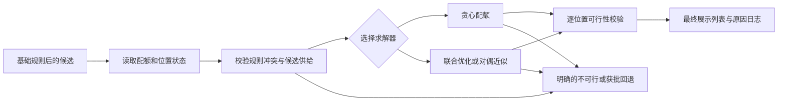

# 约束优化与编排

约束优化与编排处理类目、作者、商家、模块和位置的配额与编排。它接收[基础规则与约束](../基础规则与约束/README.md)已经确认可展示的候选和 L2 效用，在满足列表级硬约束的前提下选择每个位置的候选；它不负责把库存、合规或强频控重新解释为可交换的软分数。

本模块既可以作为[列表重排](../列表重排/README.md)后的“配额与位置收口”，也可以与相关性、多样性共同联合求解。前者更容易解释和回退，后者能避免先重排再修补的损失，但必须明确候选规模、内存上界和可行解优先的超时策略。

## 1. 输入、输出与约束契约

最小输入包含候选级效用、稳定顺序、约束归属、位置属性和请求时策略版本：

| 字段 | 作用 |
| --- | --- |
| `candidate_id`、`input_index`、`utility` | 稳定标识、同分回放与 L2 校准效用 |
| `segments` | 类目、作者、商家、内容类型等可计数归属 |
| `eligible_positions` | 候选允许展示的位置或模块 |
| `quota_rules` | 分组、窗口、下限/上限、硬软属性与规则版本 |
| `position_weights` | 位置价值或模块目标，须版本化 |
| `solver_deadline`、`fallback_policy` | 可用请求预算与获批回退方式 |

输出必须包含有序列表，以及每一位置的 `selection_reason`、命中配额、约束/特征版本、求解状态（`optimal`、`feasible_timeout`、`fallback`）和未填满位置的原因。相同输入、规则版本和状态版本下，输出及原因应确定。

## 2. 可行域与目标

令 $x_{i,p}\in\{0,1\}$ 表示候选 $i$ 是否位于位置 $p$，$u_i$ 为候选效用，$w_p$ 为位置权重。一个常见的硬约束骨架为：

$$
\begin{aligned}
\max_x\quad & \sum_{i,p} w_p u_i x_{i,p} + \text{soft\_bonus}(x)\\
	ext{s.t.}\quad & \sum_i x_{i,p}\leq 1 && \forall p,\\
& \sum_p x_{i,p}\leq 1 && \forall i,\\
& L_g\leq \sum_{i\in g,p}x_{i,p}\leq U_g && \forall \text{ hard quota }g,\\
& x_{i,p}=0 && \text{if } i \text{ is ineligible at } p.
\end{aligned}
$$

下限 $L_g$、上限 $U_g$ 和位置资格都属于可行域；可降级的运营目标才可以写入 `soft_bonus` 或惩罚项。请求进入求解前必须先检查下限是否超过页面长度、分组是否有足够候选、规则是否相互冲突；不可行时返回结构化 `infeasible_reason`，不能静默违反硬约束。

## 3. 复杂度、内存与 deadline

令 $N$ 为候选数，$K$ 为页面位置数，$R$ 为每候选需检查的有效约束数，$G$ 为配额分组数。特征读取、状态 RPC 和模型服务排队不计入下表的 Big-O，但必须单独计入 P99。

| 方法 | 请求时计算 | 增量空间 | 适用边界 |
| --- | --- | --- | --- |
| 贪心配额扫描 | $O(NKR)$ | $O(G+K)$ | 规则清晰、$N/K$ 有上限、需要稳定低时延。 |
| 整数规划 | 最坏情形指数级 | 通常至少 $O(NK)$ 变量/约束状态 | 仅严格截断后、求解器与内存预算明确时。 |
| 拉格朗日/对偶近似 | 每轮常为 $O(NKR)$，共 $T$ 轮 | $O(G+K)$ 到 $O(NK)$，依实现而定 | 需要可控近似与 warm start 时。 |

上线必须将“候选截断、约束状态准备、求解、结果校验”分别计时。任何精确或迭代方法都应在 deadline 前预留校验和回退预算；超时只能返回已经验证可行的中间解，不能返回未完成或未经硬约束检查的部分结果。

## 4. 在线执行与降级

推荐回退链路是：已验证联合解 -> 可行贪心解 -> 相关性稳定顺序下的可行补位 -> 候选不足的显式空位。回退不会绕过基础规则，也不能把硬下限改为软目标；若业务允许下限降级，必须由版本化的 `fallback_policy` 明确指定。

## 5. 评测与验收

- 离线同时评估候选效用/NDCG、位置加权效用、配额满足率、不可行率、候选不足率、供给集中度和与贪心基线的增益。
- 线上按规则/策略版本记录求解耗时、P50/P99、超时率、回退率、空位率、约束违例数和每个位置的调整原因。
- 对下限供给不足、重叠分组、候选位置不兼容、同分、状态过期、求解器不可行和 deadline 耗尽建立回放测试。

| 专题 | 关注问题 |
| --- | --- |
| [贪心配额](./贪心配额/README.md) | 可解释、低时延的逐位置选取与计数约束。 |
| [整数规划与拉格朗日方法](./整数规划与拉格朗日方法/README.md) | 多约束下的精确或近似优化。 |