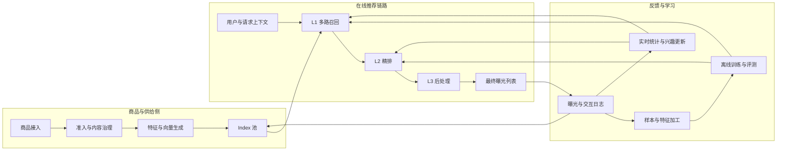
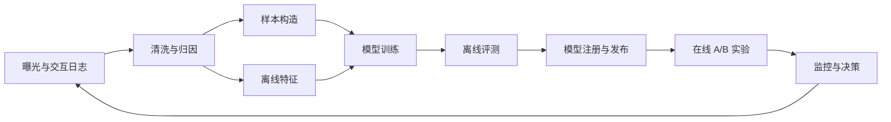

# 推荐系统整体架构综述

工业推荐系统需要在大规模商品集合中，以较低延迟为当前用户生成具有相关性、价值和可控性的推荐列表。单个模型很难同时承担全库检索、复杂特征计算和列表约束，因此典型系统采用多阶段漏斗：先维护可推荐的 **Index 池**，再依次经过 **L1 召回、L2 精排和 L3 后处理**。

四个模块分别解决“哪些商品可以推荐”“哪些商品可能相关”“候选商品的个性化价值是多少”以及“最终列表应如何展示”的问题。这里的商品是广义推荐对象，可以是电商商品、视频、文章、音乐、广告、房源或商户。

## 一、端到端系统框架

这条链路并不是单向流水线。商品状态会持续改变 Index 池，用户反馈会更新实时特征、召回结果和排序模型，实验与评测则决定模型及策略是否可以发布。

## 二、四个核心模块

| 模块 | 核心问题 | 典型输入 | 典型输出 | 主要约束 |
| --- | --- | --- | --- | --- |
| Index 池 | 哪些商品当前可被推荐 | 原始商品、内容、属性、状态、策略规则 | 可检索商品及多种索引 | 合规、完整性、新鲜度、容量、一致性 |
| L1 召回 | 哪些商品可能与当前请求相关 | 用户、上下文、查询和 Index 池 | 数百至数千个候选及召回信息 | 覆盖率、相关性、低延迟、多路互补 |
| L2 精排 | 每个候选对当前用户的价值是多少 | 候选及丰富的用户、商品、上下文特征 | CTR、CVR、时长等预估值和综合分 | 准确性、校准、多目标、推理成本 |
| L3 后处理 | 最终应展示怎样的有序列表 | 精排分数、商品属性、业务状态和列表约束 | 可直接曝光的最终序列 | 多样性、公平、合规、体验、长期价值 |

### 1. Index 池：可推荐商品与检索基础

Index 池不是简单的数据库表，而是**可推荐商品集合、检索特征和在线索引的组合**。它决定后续阶段能看到哪些商品，因此其覆盖、新鲜度和治理质量构成推荐效果的上限。

典型结构包括：

1. **供给接入**：接收商品创建、内容发布、库存更新和上下架事件。
2. **准入治理**：完成审核、去重、质量检查、权限、地域和年龄限制。
3. **特征加工**：生成类目、标签、文本、图像、价格、质量分和向量表示。
4. **池化组织**：维护全量池、类目池、地域池、新品池、运营池和实验池。
5. **索引构建**：根据召回方式建立倒排、ANN、图、关键词或规则索引。
6. **增量更新**：处理新商品进入、状态变更、特征刷新和失效商品删除。
7. **版本管理**：保证商品、特征与索引版本可追踪，并支持发布、回滚和容灾。

Index 池与 L1 召回的边界是：Index 池负责准备**可检索空间**，召回负责根据请求从该空间选择候选。同一商品可以存在于多个逻辑池或索引中，但必须有统一商品 ID 和状态真值。

### 2. L1 召回：大规模候选生成

召回阶段在严格时延预算内，将百万至十亿级商品压缩到数百或数千个候选。由于单一方法难以覆盖全部兴趣，工业系统通常采用多路召回。

常见召回通道包括：

- 协同过滤和 Item-to-Item 召回。
- 双塔向量召回和 ANN 检索。
- 用户历史、会话兴趣和序列召回。
- 内容、类目、标签、作者或品牌召回。
- 热门、趋势、地域和上下文召回。
- 搜索词、知识图谱或生成式召回。
- 新品、运营、广告和探索通道。

召回服务通常包括请求理解、通道并发、超时控制、候选过滤、去重、配额和融合。每个候选除商品 ID 外，还应携带召回通道、通道分数、召回原因和索引版本，供后续精排、分析和归因使用。

召回阶段优先保证相关候选不被遗漏，通常以 Recall、Hit Rate、候选覆盖、通道贡献、Index 新鲜度和 P95/P99 时延衡量。它不追求候选内部的最终严格顺序。

### 3. L2 精排：个性化价值预估

精排阶段面向召回候选获取更丰富的特征，并使用复杂模型估计用户采取不同行为的概率或期望价值。相比召回，它处理的商品更少，因此可以投入更多计算。

典型精排结构包括：

1. **特征获取**：读取用户画像、长期与短期行为、商品属性、交叉特征和实时上下文。
2. **特征处理**：完成离散编码、归一化、Embedding 查询、序列截断和缺失值处理。
3. **模型推理**：使用特征交互、注意力、序列、多任务或多场景模型。
4. **多目标预估**：同时预测点击、转化、停留、收藏、负反馈和长期价值。
5. **分数融合**：结合业务价值形成统一效用分，并进行校准或分场景修正。
6. **候选截断**：按综合分选择较小的高质量集合交给后处理。

精排需要重点解决训练与服务特征一致性、位置与曝光偏差、延迟反馈、多任务冲突和模型推理成本。常用指标包括 AUC、LogLoss、NDCG、校准误差、分群效果和在线业务指标。

### 4. L3 后处理：列表生成与约束执行

精排通常独立计算每个商品的分数，而最终页面展示的是一个列表。L3 后处理将逐商品分数转化为满足用户体验和业务约束的最终序列。

典型处理步骤包括：

- 硬过滤：移除下架、无库存、重复、无权限或不合规商品。
- 分数调整：根据时效、质量、业务价值和场景进行校准。
- 去重打散：限制同类目、同作者、同品牌或高度相似内容连续出现。
- 多样性重排：在相关性与主题、形式、供给多样性之间平衡。
- 业务编排：控制广告、运营位、新品和自然推荐的数量与位置。
- 公平与生态：约束供给侧曝光集中度，避免单一主体长期垄断。
- 频控与已读过滤：降低重复曝光和用户疲劳。
- 列表级优化：使用约束优化、MMR、学习重排或长期策略生成序列。

后处理必须区分硬约束和软目标。合规、库存等硬约束必须满足；多样性和业务价值等软目标则应在相关性损失可控的前提下优化。

## 三、阶段接口设计

清晰的阶段接口可以减少模块之间的隐式依赖，并支持独立迭代和故障定位。

| 接口 | 应携带的主要信息 |
| --- | --- |
| Index 池 -> L1 | 商品 ID、池与索引标识、可用状态、检索特征、索引版本、更新时间 |
| L1 -> L2 | 商品 ID、召回通道、通道分数、召回原因、通道排名、索引版本 |
| L2 -> L3 | 多任务预估值、综合效用分、校准值、质量与风险分、关键商品属性 |
| L3 -> 曝光 | 最终位置、调整原因、命中规则、实验桶、模型与策略版本 |
| 曝光 -> 日志 | 请求 ID、候选与曝光集合、位置、分数、版本、时间和用户反馈 |

所有阶段应共享稳定的请求 ID、用户/设备标识、商品 ID、场景、实验桶和时间戳。字段需要版本化，避免上游更新后下游静默使用错误语义。

## 四、在线请求的典型执行过程

一次推荐请求通常经历以下步骤：

1. 网关完成鉴权、场景识别、实验分流和超时预算分配。
2. 用户与上下文服务返回画像、行为序列、设备、地域和实时状态。
3. L1 并发调用多个召回通道，从不同 Index 中获取候选。
4. 召回层完成过滤、去重、配额和粗粒度融合。
5. 特征服务批量获取候选所需的在线特征。
6. L2 模型服务进行多目标预估和效用分计算。
7. L3 执行硬约束、去重、多样性、业务编排和列表重排。
8. 结果返回客户端，同时异步记录候选、曝光、版本和时延日志。
9. 点击、停留、转化和负反馈进入实时与离线数据链路。

每个阶段都需要独立超时和降级。例如某个个性化召回通道超时时，可使用缓存、热门通道或其他召回结果补足；精排不可用时，可退化到轻量模型；后处理仍必须保留安全与合规硬规则。

## 五、离线数据与学习闭环

在线服务只负责当前决策，模型迭代依赖完整的数据闭环：

数据链路应明确曝光、点击、停留、转化和负反馈的口径，并记录候选生成过程。只记录最终点击无法还原召回覆盖、位置偏差和策略选择过程，也难以进行可靠的反事实评价。

## 六、典型部署结构

中大型系统通常将各阶段拆为独立服务：

- **商品与索引服务**：维护商品真值、检索特征和多种在线 Index。
- **用户与上下文服务**：提供画像、行为序列、实时状态和场景信息。
- **召回服务**：并发调度多路检索，执行融合、过滤和超时控制。
- **特征服务**：统一管理离线与在线特征，支持批量低延迟读取。
- **模型推理服务**：托管精排模型，负责版本、灰度、批处理和资源隔离。
- **策略与后处理服务**：执行规则、约束、实验策略和列表级优化。
- **日志与监控平台**：记录决策链路，监控效果、时延、容量和异常。
- **训练与评测平台**：完成样本、训练、离线评测、模型注册和发布审批。

规模较小时，这些能力可以合并在一个服务中；规模扩大后再按吞吐、更新频率、团队边界和故障隔离需求拆分。服务拆分不是目标，稳定且可观测的阶段契约才是关键。

## 七、横切系统能力

以下能力贯穿四个核心模块，不能只由某个模型负责：

### 特征一致性

训练和在线服务必须使用一致的定义、窗口、默认值和版本。特征注册、回填、实时更新和缺失率都应可观测。

### 实验与版本管理

索引、召回策略、模型、后处理规则和特征都需要独立版本。日志必须能还原一次请求使用的完整版本组合。

### 延迟与容量

总时延预算应分配到各阶段，并监控平均值和尾延迟。召回并发数、候选数量、特征读取量和模型复杂度需要联合控制。

### 降级与容灾

为每个外部依赖设置超时、缓存、熔断和兜底策略。降级路径应定期演练，并保证安全、合规和库存等硬约束始终有效。

### 可观测性

除最终 CTR 外，还应监控 Index 规模与新鲜度、各路召回量与重合率、特征缺失、模型分数分布、过滤原因、列表多样性以及各阶段时延。

### 隐私、公平与安全

用户数据采集、特征使用和日志保存需要满足隐私要求；商品准入、模型预测和列表分配都要考虑内容安全与供给公平。

## 八、架构评价指标

| 维度 | 代表指标 |
| --- | --- |
| Index 池 | 可用商品覆盖、索引新鲜度、更新延迟、无效商品率、特征完整率 |
| L1 召回 | Recall、Hit Rate、候选覆盖、通道贡献、通道重合率、召回时延 |
| L2 精排 | AUC、LogLoss、NDCG、校准误差、分群效果、推理吞吐与时延 |
| L3 后处理 | 列表多样性、重复率、约束满足率、供给集中度、规则触发率 |
| 端到端业务 | CTR、CVR、观看时长、GMV、留存、负反馈和长期价值 |
| 系统稳定性 | P95/P99 时延、超时率、回退率、错误率、资源利用率和可用性 |

任何单阶段指标都不能代替端到端实验。召回覆盖提升可能增加精排负担，精排分数提升可能被后处理规则抵消，多样性增加也可能牺牲短期点击，因此需要同时观察阶段指标和最终业务指标。

## 九、常见架构误区

- 把商品数据库直接等同于 Index 池，忽略准入、索引和生命周期管理。
- 让召回承担最终排序，或要求精排弥补召回阶段已经丢失的商品。
- 只传递商品 ID，不记录召回原因、模型版本和过滤过程。
- 精排训练使用离线完整特征，线上却存在缺失、延迟或不同默认值。
- 将全部业务规则堆在模型分数中，导致约束不可解释且难以回滚。
- 只记录最终曝光和点击，无法分析候选链路与曝光偏差。
- 只优化平均时延，忽略尾延迟和依赖故障下的降级行为。
- 只关注单模型离线指标，缺少端到端 A/B 实验和长期效果监控。