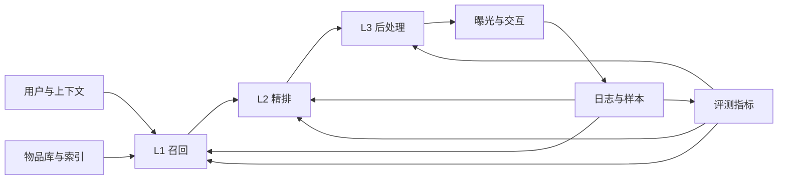

# 推荐系统架构综述

## 1. 端到端链路

## 2. 三阶段职责

| 阶段 | 输入 | 输出 | 核心约束 |
| --- | --- | --- | --- |
| L1 召回 | 用户、上下文、全量物品库 | 多路候选及召回原因 | 覆盖、时延、索引新鲜度 |
| L2 精排 | 候选、用户/物品/上下文特征 | 多任务预估值或效用分数 | 准确性、校准、推理成本 |
| L3 后处理 | 精排分数、列表约束、业务状态 | 最终有序列表 | 多样性、公平、合规、长期价值 |

## 3. 阶段接口

- 召回到精排：物品 ID、召回通道、通道分数、召回原因、模型与索引版本。
- 精排到后处理：CTR/CVR/时长等任务分数、校准值、不确定性和物品属性。
- 服务到评测：请求 ID、实验桶、曝光位置、模型版本、时延和交互标签。

## 4. 横切问题

数据口径、训练与服务一致性、多目标优化、实时特征、容量与降级、可观测性、隐私公平和实验方法贯穿所有阶段。它们应由共享平台承接，而不是在每个模型中重复实现。